# BDPP-IoT Secure Data Transaction

BDPP-IoT is an academic prototype for secure Internet of Medical Things (IoMT) data sharing. It extends the base paper's blockchain-based IoT data transaction design with revocation-aware access control, CKKS reliability checking, real IPFS/blockchain integration, ML-calibrated pricing, and ablation experiments.

The implementation follows the base paper's simulated IoMT evaluation style: no real patient data is used. Synthetic IoMT records are generated and passed through an end-to-end secure transaction pipeline.

## Project Goals

This repository supports both parts of the Information Security project:

| Part | Purpose | Repository Support |
|---|---|---|
| Part A: Research | Literature review, gaps, proposed methodology, comparison, use case, ablation, results | `docs/report_sections/` |
| Part B: Implementation | Python implementation, experiments, tables, 400 DPI graphs | `src/`, `run_experiments.py`, `outputs/` |

The proposed methodology improves the base design in three main ways:

| Gap in Base Methodology | BDPP-IoT Extension |
|---|---|
| Single-authority access control and weak revocation handling | Policy-level Multi-Authority CP-ABE model with blockchain version revocation |
| CKKS computation is approximate but reliability is not explicitly checked | Operation-aware Error-Bound Reporting (EBR) |
| Pricing uses manually configured/static parameters | Random Forest ML-calibrated dynamic pricing |

## Implementation Status

| Component | Implementation |
|---|---|
| Synthetic IoMT data | Implemented in Python |
| MA-CP-ABE | Formal policy-level model, not real pairing-based cryptographic CP-ABE |
| Revocation | Blockchain version checking |
| CKKS encrypted computation | TenSEAL CKKS with simulator fallback |
| Error-Bound Reporting | Implemented |
| IPFS storage | Kubo CLI backend with simulator fallback |
| Blockchain | Ganache + Solidity + Web3.py |
| ML pricing | scikit-learn Random Forest |
| Ablation study | Implemented |
| 400 DPI graphs | Generated under `outputs/figures/` |

Important qualification:

```text
The proposed MA-CP-ABE component is implemented as a policy-level simulation with
authority fragments, Boolean access policies, blockchain version checking, and
revocation logic. It is not a real pairing-based MA-CP-ABE cryptographic library.
```

CKKS, IPFS storage, blockchain logging, ML pricing, and the experiment pipeline are implemented with real Python/tooling integrations.

## Architecture Overview

BDPP-IoT keeps the layered style of the base paper and adds reliability and adaptive pricing logic.

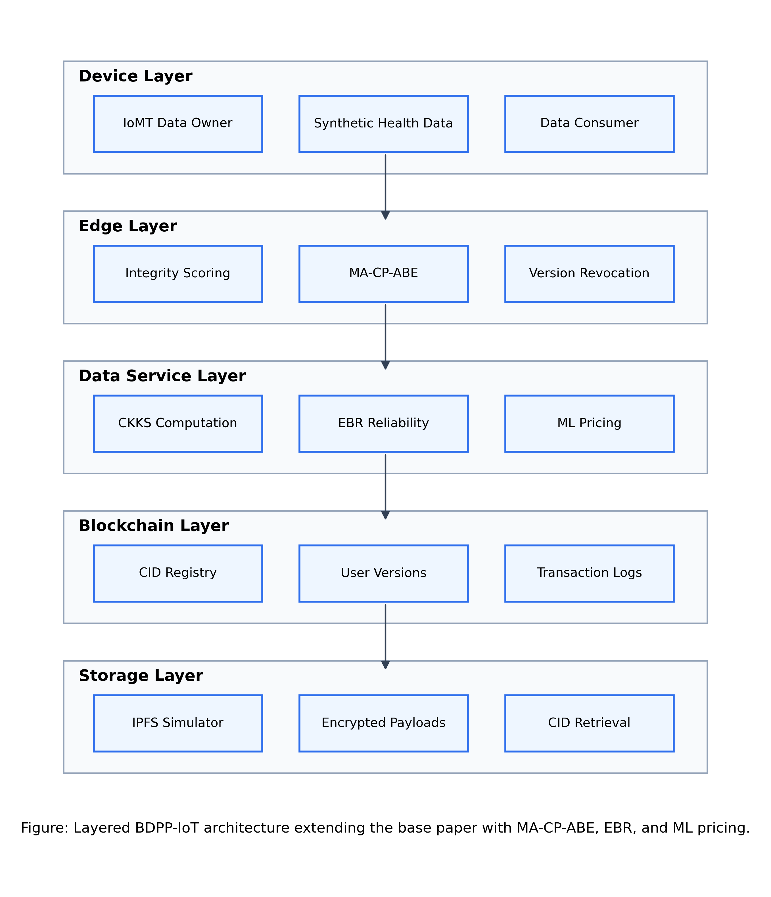

### Layer Responsibilities

| Layer | Responsibilities |
|---|---|
| Device Layer | Synthetic IoMT sensors, health measurements, metadata generation |
| Edge Layer | Policy parsing, authority fragments, revocation-aware access decisions |
| Data Service Layer | TenSEAL CKKS computation, EBR reliability check, ML pricing |
| Blockchain Layer | CID storage, user versioning, revocation, reliability and transaction logs |
| Data Storage Layer | IPFS Kubo storage or local simulator fallback |

## Methodology Pipeline

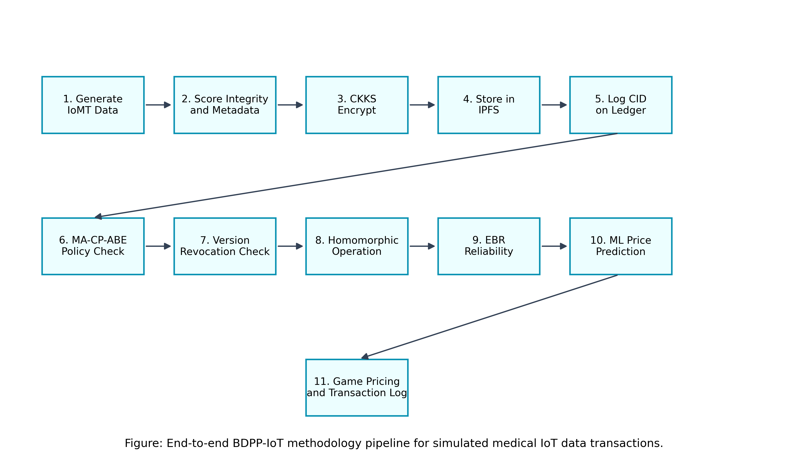

The pipeline executed by `run_experiments.py` is:

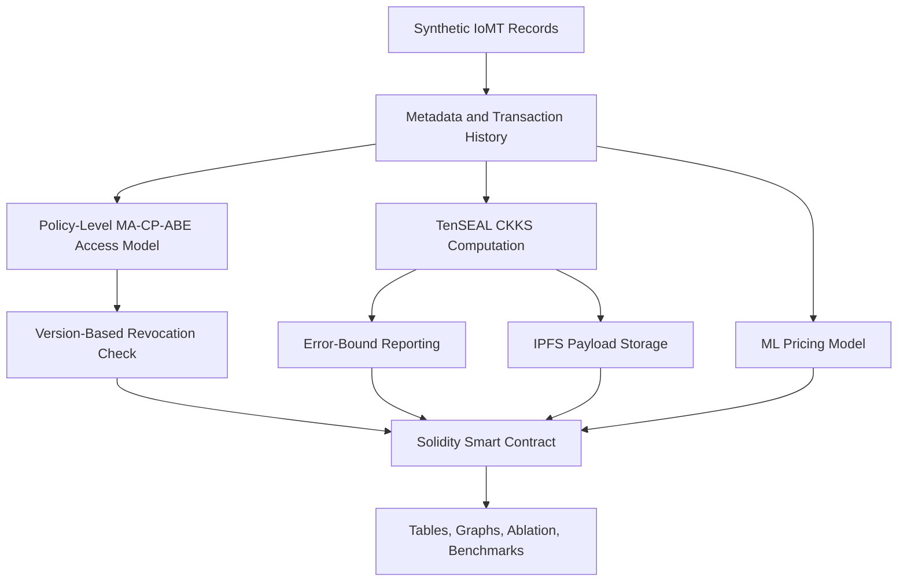

## End-to-End Transaction Design

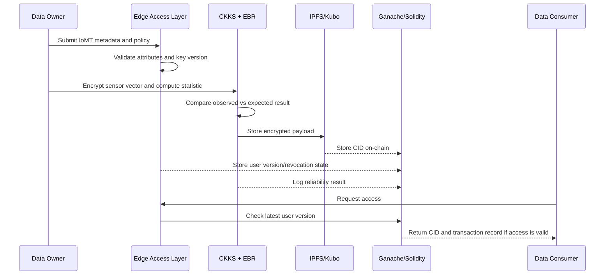

## Repository Structure

```text
BDPP-IoT-Secure-Data-Transaction/
  README.md
  requirements.txt
  package.json
  package-lock.json
  run_experiments.py
  contracts/
    BDPPLedger.sol
  docs/
    algorithms.md
    system_design.md
    report_sections/
      06_proposed_methodology.md
      07_system_architecture.md
      08_mathematical_model_and_algorithms.md
      09_implementation_setup.md
      10_experimental_design.md
      11_results_and_discussion.md
  src/
    bdpp_iot/
      access_control/
      blockchain/
      crypto/
      data/
      experiments/
      pricing/
      storage/
      visualization/
      workflow/
  outputs/
    figures/
    tables/
```

## Main Modules

| Path | Purpose |
|---|---|
| `src/bdpp_iot/access_control/` | Policy-level MA-CP-ABE model and Boolean policy parser |
| `src/bdpp_iot/crypto/` | TenSEAL CKKS backend, CKKS simulator fallback, EBR |
| `src/bdpp_iot/storage/` | IPFS Kubo backend and simulator fallback |
| `src/bdpp_iot/blockchain/` | Solidity compilation, Ganache manager, Web3 contract client |
| `src/bdpp_iot/pricing/` | Static pricing baseline and ML pricing model |
| `src/bdpp_iot/experiments/` | Ablation, runtime, blockchain benchmark, resource monitoring |
| `src/bdpp_iot/visualization/` | 400 DPI figures and architecture diagrams |
| `src/bdpp_iot/workflow/` | Full secure transaction demo |

## Quick Start

### 1. Clone the Repository

```powershell
git clone https://github.com/danishali778/BDPP-IoT-Secure-Data-Transaction.git
cd BDPP-IoT-Secure-Data-Transaction
```

### 2. Create Python Virtual Environment

```powershell
python -m venv .venv
.\.venv\Scripts\python.exe -m pip install --upgrade pip
.\.venv\Scripts\python.exe -m pip install -r requirements.txt
```

### 3. Install Node Dependency for Ganache

```powershell
npm install
```

`package.json` installs Ganache, which is used as the local Ethereum blockchain.

### 4. Optional: Install IPFS Kubo

The project attempts to use the real Kubo CLI when available. If Kubo is missing, the pipeline falls back to the local `IPFS_SIM` backend.

To use real Kubo, install the `ipfs` command or place the Kubo binary at:

```text
tools/kubo/kubo/ipfs.exe
```

### 5. Run the Full Experiment

```powershell
.\.venv\Scripts\python.exe run_experiments.py
```

The run prints each stage:

```text
[1/12] Preparing output folders...
[2/12] Generating synthetic IoMT sensor records...
[3/12] Generating historical transaction records for ML pricing...
[4/12] Evaluating MA-CP-ABE access control and revocation...
[5/12] Running TenSEAL CKKS computation with EBR reliability checks...
[6/12] Training/evaluating ML-calibrated pricing model...
[7/12] Running ablation study...
[8/12] Running prototype runtime comparison...
[9/12] Running full secure transaction demo: MA-ABE + TenSEAL + IPFS + Ganache...
[10/12] Running smart-contract benchmark table...
[11/12] Collecting CPU and memory resource table...
[12/12] Saving CSV tables and 400 DPI figures...
```

## Generated Outputs

| Output | Location |
|---|---|
| CSV result tables | `outputs/tables/` |
| 400 DPI report figures | `outputs/figures/` |
| Solidity compiled artifact | `outputs/contracts/BDPPLedger.json` |
| IPFS payload cache | `outputs/ipfs_payloads/` |
| Ganache logs | `outputs/logs/` |

The repository includes a generated result snapshot under `outputs/tables/` and `outputs/figures/` for report use.

## Visual Results

### Access Control

BDPP-IoT allows valid users and blocks invalid or revoked users in the policy-level model, while the base-style model does not block revoked users.

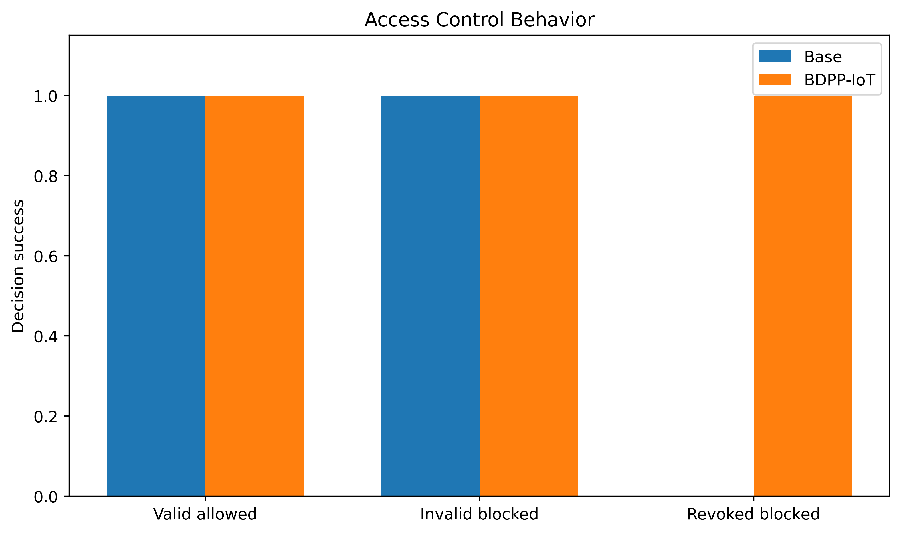

### CKKS Error-Bound Reporting

The EBR module compares the observed CKKS result against an operation-aware expected result and detects high-noise outputs.

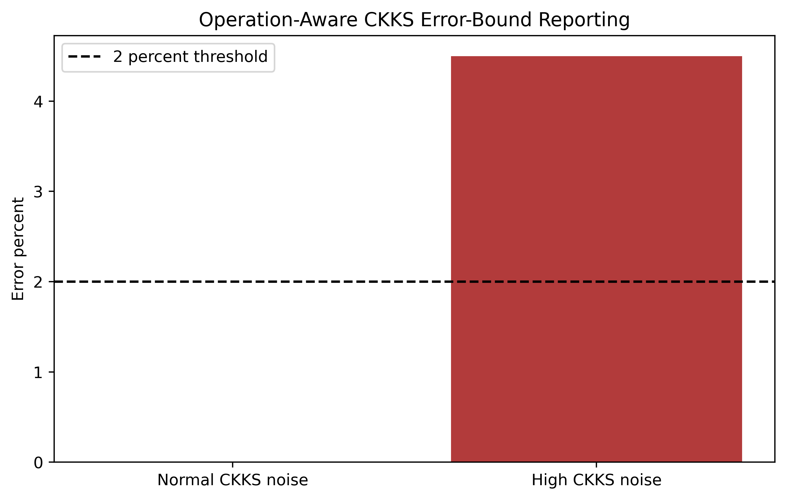

### Pricing Error

The ML pricing layer reduces pricing error compared with the static pricing baseline.

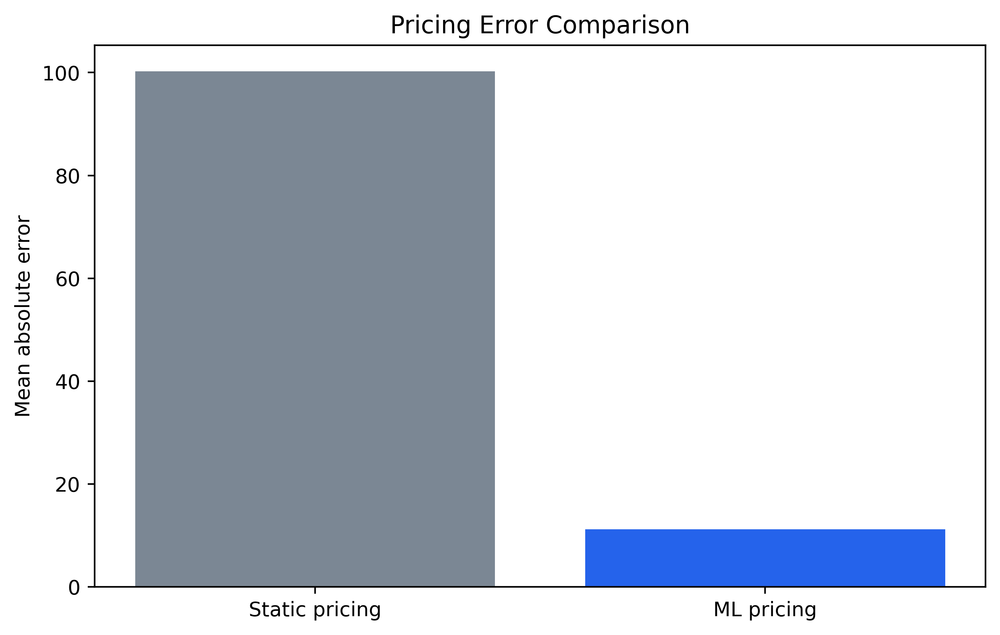

### Pricing R2

The static pricing model has negative R2, while the ML model captures most of the synthetic transaction-price variance.

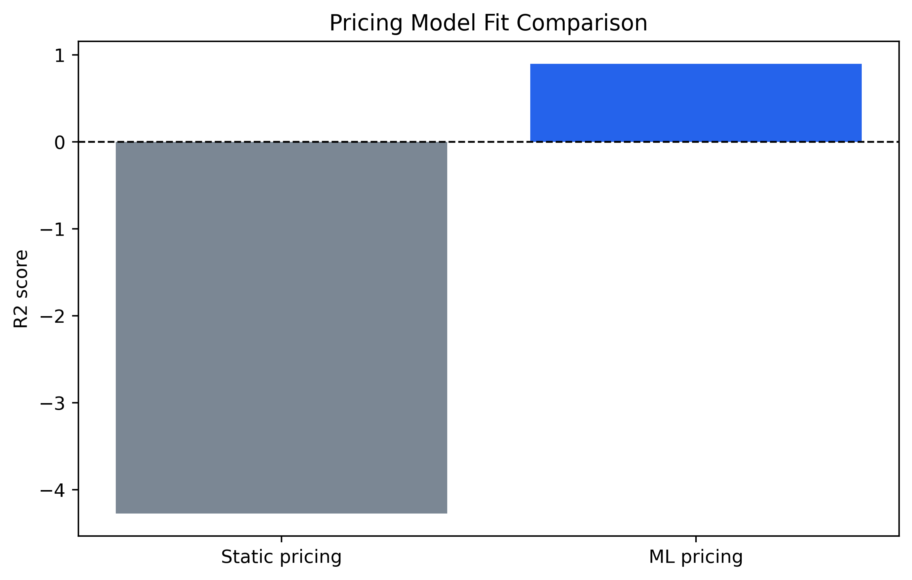

### Ablation Study

The ablation study shows the effect of removing revocation, EBR, or ML pricing.

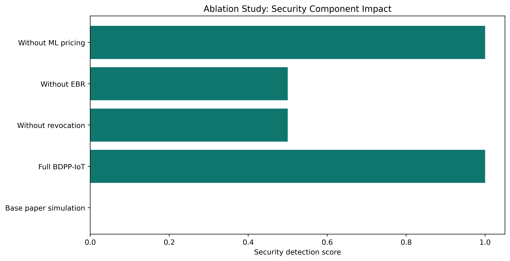

### Blockchain Throughput

The smart contract benchmark measures throughput for CID storage, user registration, revocation, reliability logging, and transaction logging.

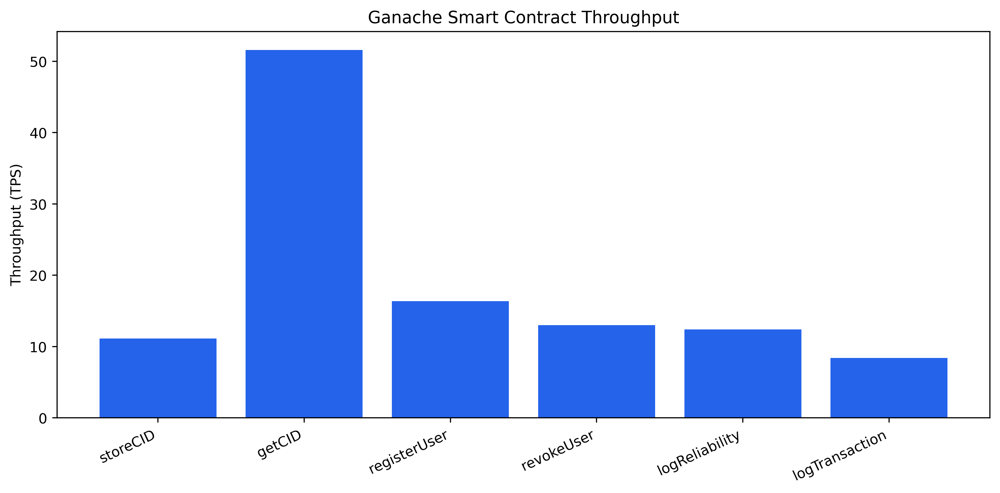

### Resource Consumption

The resource monitor records CPU and memory usage for the Python pipeline, Ganache, and IPFS when active.

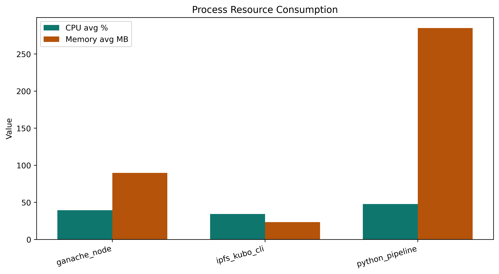

### Runtime Comparison

BDPP-IoT adds security, reliability, and integration overhead compared with the base simulation.

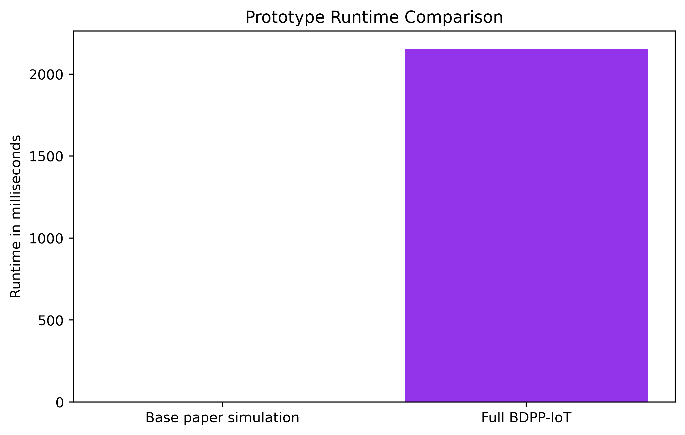

## Result Snapshot

### Pricing Results

| Model | MAE | RMSE | R2 |
|---|---:|---:|---:|
| Static Pricing | 100.2701 | 105.3340 | -4.2761 |
| ML Pricing | 11.2174 | 14.7402 | 0.8967 |

Pricing improvement:

```text
88.8128 percent
```

### Ablation Results

| Configuration | Revocation | EBR | ML Pricing | Security Score | Pricing Improvement |
|---|---:|---:|---:|---:|---:|
| Base paper simulation | 0 | 0 | 0 | 0.0 | 0.0 |
| Full BDPP-IoT | 1 | 1 | 1 | 1.0 | 88.8128 |
| Without revocation | 0 | 1 | 1 | 0.5 | 88.8128 |
| Without EBR | 1 | 0 | 1 | 0.5 | 88.8128 |
| Without ML pricing | 1 | 1 | 0 | 1.0 | 0.0 |

### Secure Transaction Demo

The end-to-end demo verifies:

| Check | Expected Behavior |
|---|---|
| CKKS backend | Uses `TENSEAL_CKKS` when TenSEAL is installed |
| Storage backend | Uses `IPFS_KUBO` when Kubo is available, otherwise `IPFS_SIM` |
| Blockchain backend | Uses `GANACHE_SOLIDITY` when Ganache is available |
| CID consistency | IPFS CID matches on-chain CID |
| Valid user | Allowed |
| Revoked user | Blocked |
| Reliability | CKKS result logged as reliable when below threshold |

## Base-Paper-Style Tables

The project also generates image versions of base-paper-style evaluation tables:

| Table Figure | Purpose |
|---|---|
| `outputs/figures/base_paper_tables/base_paper_table_3_functional_tests.png` | Functional test style table |
| `outputs/figures/base_paper_tables/base_paper_table_4_caliper_performance.png` | Blockchain performance style table |
| `outputs/figures/base_paper_tables/base_paper_table_5_resource_consumption.png` | Resource consumption style table |

## Report Sections

The detailed academic report content is drafted in Markdown:

| Section | File |
|---|---|
| Proposed Methodology | `docs/report_sections/06_proposed_methodology.md` |
| System Architecture | `docs/report_sections/07_system_architecture.md` |
| Mathematical Model and Algorithms | `docs/report_sections/08_mathematical_model_and_algorithms.md` |
| Implementation Setup | `docs/report_sections/09_implementation_setup.md` |
| Experimental Design | `docs/report_sections/10_experimental_design.md` |
| Results and Discussion | `docs/report_sections/11_results_and_discussion.md` |

These sections can be converted into LaTeX/Overleaf content for the final PDF report.

## Dependencies

Python dependencies are pinned in:

```text
requirements.txt
```

Node dependency:

```text
package.json
```

Main Python packages:

| Package | Use |
|---|---|
| `tenseal` | CKKS encrypted computation |
| `web3` | Ethereum/Ganache interaction |
| `py-solc-x` | Solidity compilation |
| `pandas`, `numpy` | data generation and metrics |
| `scikit-learn` | ML pricing model |
| `matplotlib` | 400 DPI graph generation |
| `psutil` | CPU and memory monitoring |

## Known Limitations

1. The MA-CP-ABE component is a formal policy-level model, not real cryptographic pairing-based MA-CP-ABE.
2. The IoMT dataset is synthetic and simulated, following the base paper's prototype evaluation style.
3. Ganache is a local development blockchain, so throughput and latency are not directly comparable to a production blockchain.
4. IPFS Kubo is optional in a fresh clone. If Kubo is unavailable, the project uses `IPFS_SIM`.
5. First Solidity compilation may require internet access because `py-solc-x` downloads `solc` if it is not already installed locally.

## Academic Use

This repository is intended for an Information Security academic project. The implementation demonstrates how the proposed methodology can be evaluated through:

1. End-to-end secure transaction execution.
2. Access-control and revocation tests.
3. CKKS reliability checking.
4. ML pricing evaluation using MAE, RMSE, and R2.
5. Ablation experiments.
6. Blockchain benchmark tables.
7. Resource usage tables.
8. 400 DPI visualizations for the final report.
