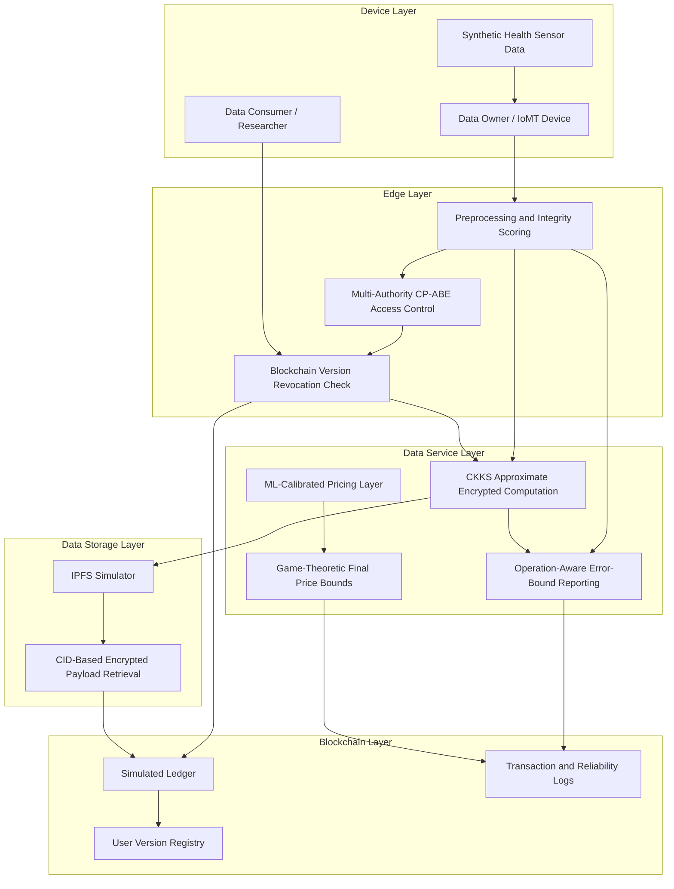

# BDPP-IoT System Design

## Layered Architecture

The implementation follows the same layered style as the base paper, but adds the proposed BDPP-IoT extensions.



## End-to-End Pipeline

```text
1. Generate simulated IoMT records.
2. Compute integrity, freshness, demand, and provider reputation metadata.
3. Register users and authorities.
4. Encrypt health data through a CKKS approximation simulator.
5. Store encrypted payload in the IPFS simulator.
6. Store CID, access metadata, user versions, and transaction logs on the ledger.
7. Evaluate access requests for valid, invalid, and revoked users.
8. Run operation-aware CKKS result verification.
9. Train ML pricing model from historical transaction records.
10. Compare baseline, proposed, and ablated configurations.
11. Save 400 DPI figures and CSV tables.
```

## Report Mapping

| Assignment Requirement | Implementation Artifact |
|---|---|
| Methodology diagram | `docs/system_design.md` |
| Mathematical algorithms | `docs/algorithms.md` |
| Proposed implementation | `src/bdpp_iot/` |
| Real CKKS implementation | `src/bdpp_iot/crypto/ckks_tenseal.py` |
| Real IPFS implementation | `src/bdpp_iot/storage/ipfs_kubo.py` |
| Real blockchain contract | `contracts/BDPPLedger.sol` |
| Real blockchain client | `src/bdpp_iot/blockchain/contract_client.py` |
| MA-CP-ABE policy model | `src/bdpp_iot/access_control/ma_abe.py` |
| Boolean access-policy parser | `src/bdpp_iot/access_control/policy.py` |
| Ablation implementation | `src/bdpp_iot/experiments/ablation.py` |
| Graphs and charts | `outputs/figures/` |
| Tables | `outputs/tables/` |
| Blockchain benchmark table | `outputs/tables/blockchain_benchmark_results.csv` |
| Resource consumption table | `outputs/tables/resource_consumption_results.csv` |
